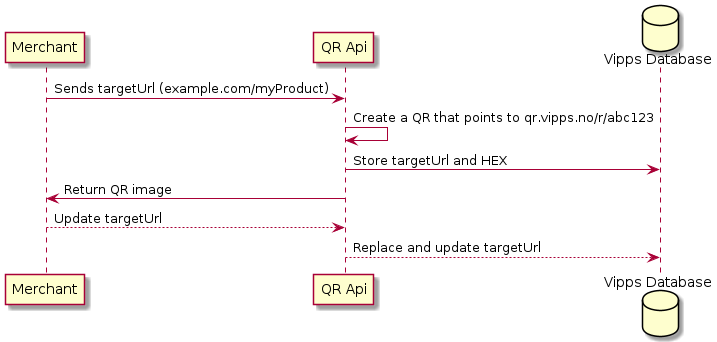

# Vipps Vipps QR API v1

There are two ways to use the Vipps QR API:
* [One-Time Payment QR](#one-time-payment-qr)
* [Merchant Redirect QR](merchant-redirect-qr)

## One-Time Payment QR

This repository contains developer resources for the Vipps QR API.

The Vipps QR API lets merchants generate Vipps QR codes that can be used to pay
over the counter, without requiring the Vipps user to provide their telephone
number to the merchant.

The QR code, when scanned and opened, will redirect the user to the Vipps
landing page, which on the phone will automatically trigger a switch to the
Vipps app where they can pay the merchant.

For more information:
* [API Guide](vipps-qr-api.md): The Vipps QR API guide
* [API FAQ](vipps-qr-api-faq.md): The Vipps QR API FAQ
* [Vipps Developers](https://github.com/vippsas/vipps-developers): The starting point for Vipps developers.
* [Getting Started](https://github.com/vippsas/vipps-developers/blob/master/vipps-getting-started.md): Information about API keys, product activation.

You can peruse the API reference documentation as:
* [Swagger UI](https://vippsas.github.io/vipps-qr-api/)
* [ReDoc](https://vippsas.github.io/vipps-qr-api/redoc.html)

## Merchant Redirect QR

Merchant redirect QR codes is a product where merchants can make printable QR
codes that redirects the user back to the merchants webpage. 

This solution is meant for more permanent use cases such as stickers,
billboards, TV-commercials, magazine ads, etc. The customer will then be able 
to scan a Vipps branded QR code that sends the user directly to a product page.

This API endpoint will make it possible to generate a Vipps-branded QR code with the
ability to change the URL the user ends up visiting.

This means that the final URL can be changed without changing the QR code.
All stickers, etc. will "point" to the new URL when the new URL is configured
by the merchant using the API.

The QR codes will be scannable from both the Vipps QR scanner and the native
camera app, and will always redirect the user to the configured `targetUrl`.

# Questions?

We're always happy to help with code or other questions you might have!
Please create an [issue](https://github.com/vippsas/vipps-ecom-api/issues),
a [pull request](https://github.com/vippsas/vipps-ecom-api/pulls),
or [contact us](https://github.com/vippsas/vipps-developers/blob/master/contact.md).

Sign up for our [Technical newsletter for developers](https://github.com/vippsas/vipps-developers/tree/master/newsletters).
