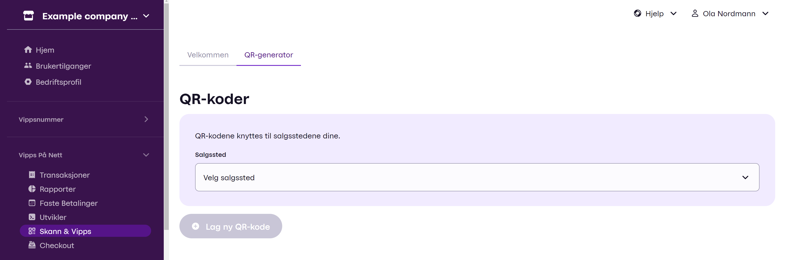
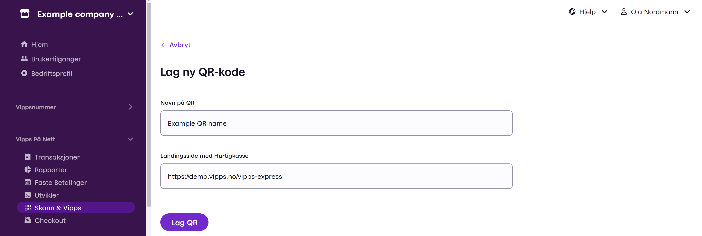
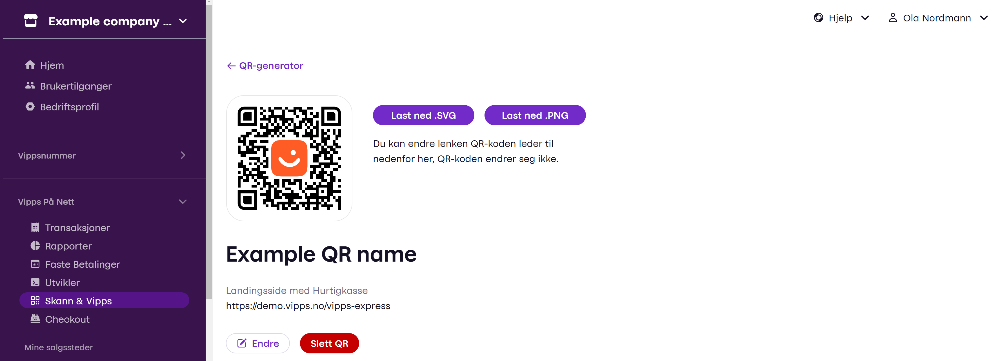
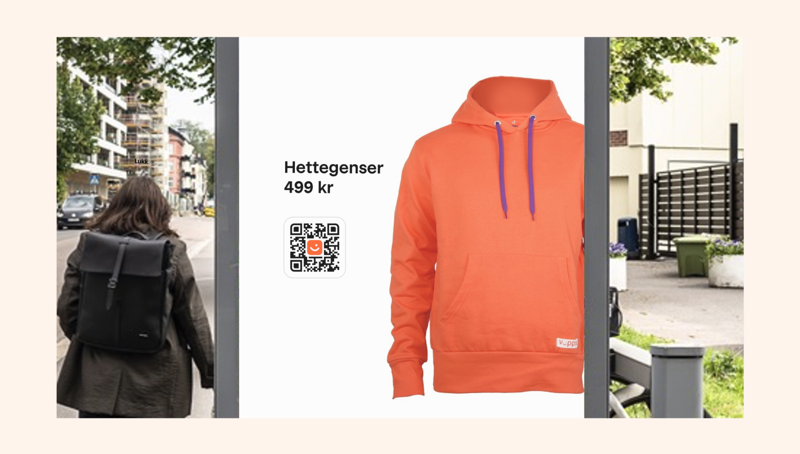
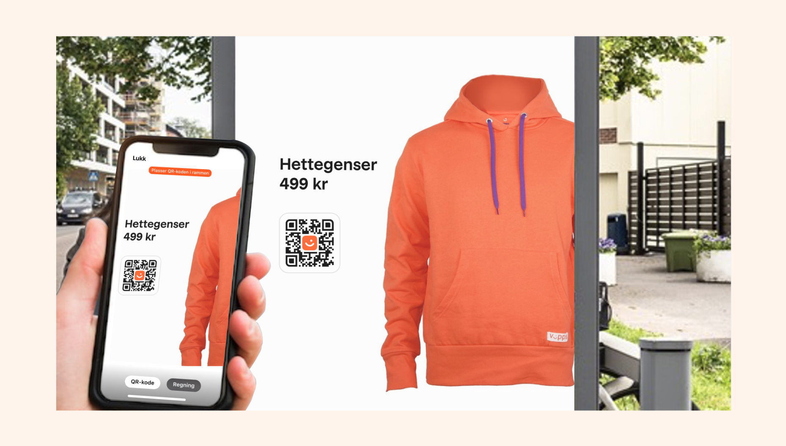
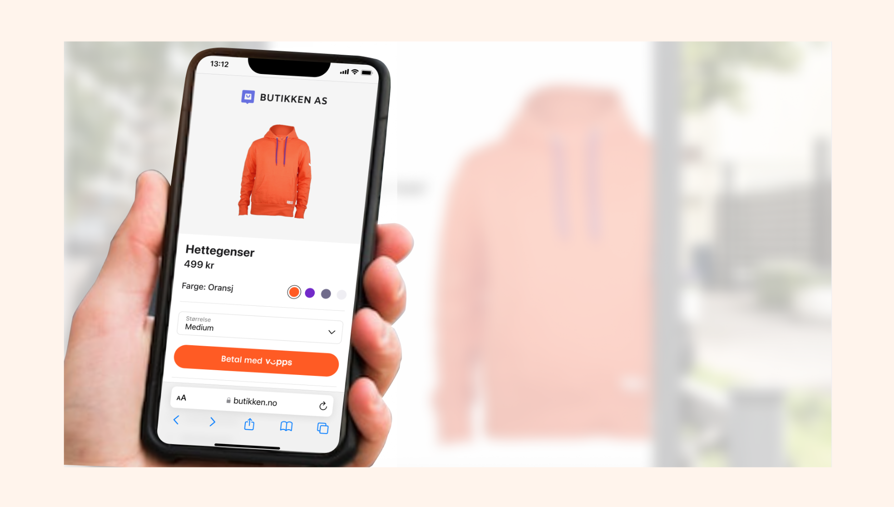
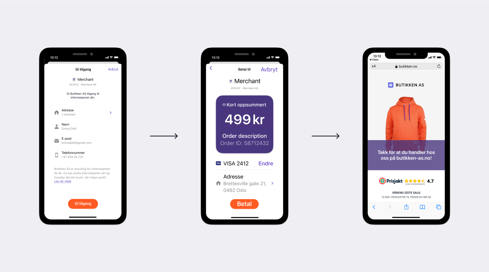

<!-- START_METADATA
---
title: How the QR API works with merchant redirect
sidebar_label: Merchant redirect
sidebar_position: 10
description: How the QR API works with merchant redirect
pagination_next: null
pagination_prev: null
hide_table_of_contents: true
---
END_METADATA -->

# How the QR API works with merchant redirect

Offer contactless payment to your customers by creating interactions in static points of sales.

### 1. The merchant generates a QR code  
Generate the QR either via the QR-api or the merchant portal. The illustrations below shows how it is done in the portal.  

First find "**Skann & Vipps**" in the left menu
  

Then select the sales unit you want to use, and click the "**Lag ny QR-kode**"-button. Now you can enter the name you want for the QR, and enter the URL.
 Click "**Lag QR**" and the QR will be created.

The QR is now created, and you can download it in either SVG or PNG. You can also change the URL or delete the QR.

### 2. The merchant places or publishes the QR code  
This will enable the merchants desired action, in a context.  

### 3. The user is interested and scans the QR code  
  

### 4. The user is redirected to the merchant's page  
  

### 5. The user performs the merchant desired action. After payment, the order is confirmed at the merchant shop.
  

