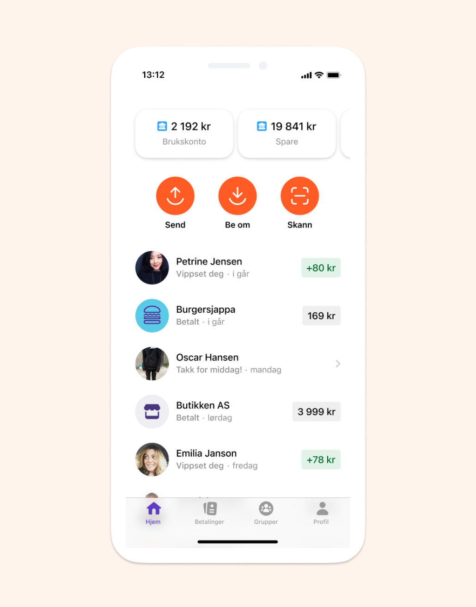
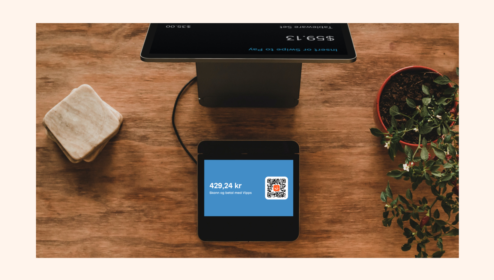
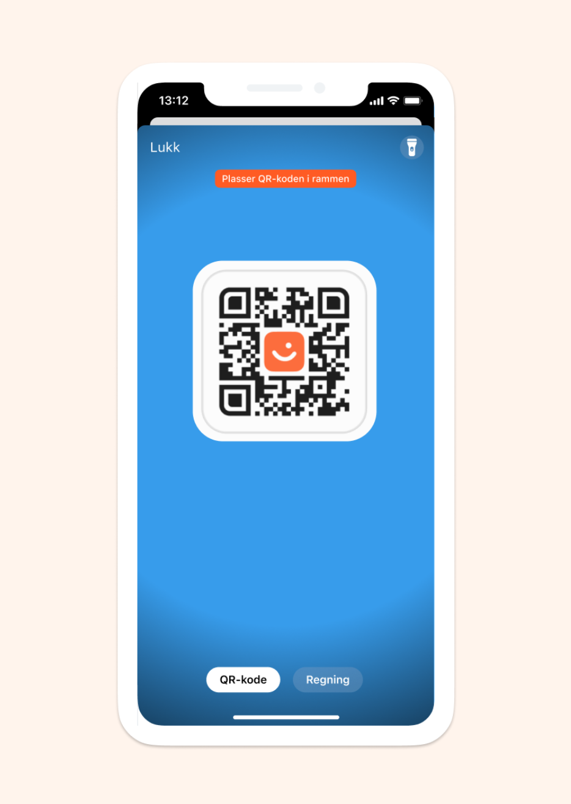
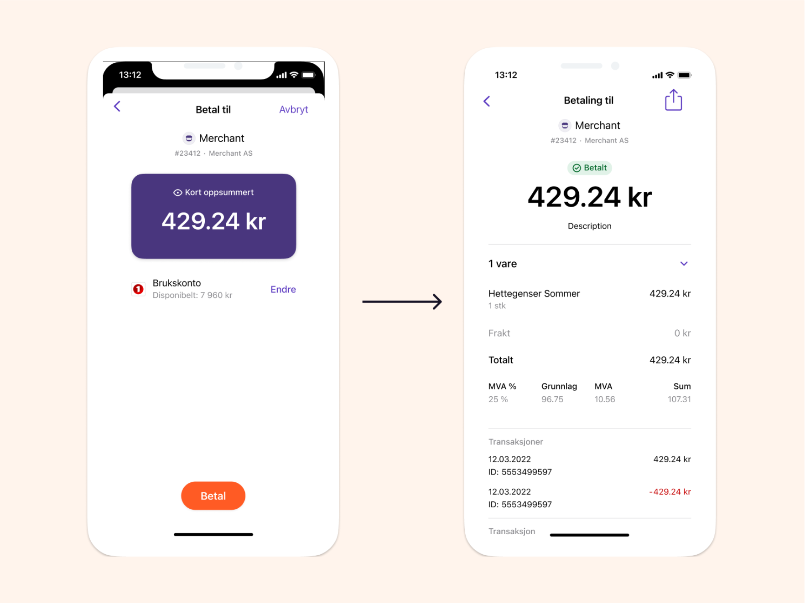

<!-- START_METADATA
---
title: How the QR API works with one-time payment
sidebar_label: One-time payment
sidebar_position: 15
description: How the QR API works with one-time payment
pagination_next: null
pagination_prev: null
hide_table_of_contents: true
---
END_METADATA -->

# How the QR API works with one-time payment  
Offer contactless payment to your customers by generating a one time QR code the user can scan to pay.

### 1. User wants to pay with Vipps  
The user uses Vipps as the preffered payment method.
  

### 2. The merchant generates a QR code
The one time QR code is presented to the user, so they can pay
  

### 3. The user scans the QR code and the payment appears on the user's phone
  

### 4. The user completes the payment  
With Order Management the merchant can send a receipt to the customer (as shown in the image below, on the right side)
